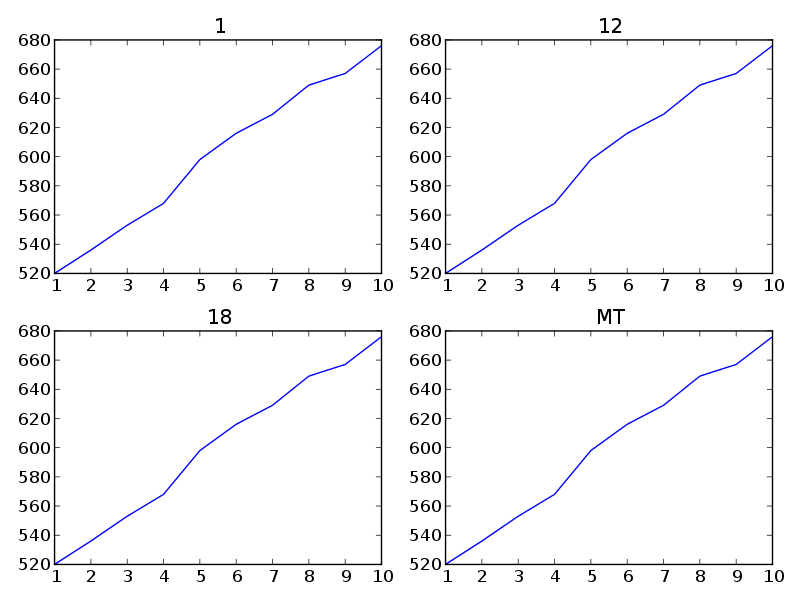

User guide
==========

Wiggelen is a light-weigh library and tries not to over-engineer. For example,
builtin datatypes such as tuples are used instead of custom objects. Sane
defaults are used throughout and things like indices are handled transparently
to the user.

The central operation in Wiggelen is walking a track. Be it in ``fixedSteps``
or ``variableSteps`` format, using any window size and step interval, walking
a track yields values one position at a time. Many operations accept walkers
as input and/or return walkers as output.

This guide uses ``a.wig`` and ``b.wig`` as example wiggle tracks, with the
following contents, respectively::

    track type=wiggle_0 name=a visibility=full
    variableStep chrom=MT
    1 520.0
    2 536.0
    3 553.0
    4 568.0

::

    track type=wiggle_0 name=b visibility=full
    variableStep chrom=MT
    1 510.0
    2 512.0
    5 508.0
    8 492.0

Walking over a track
--------------------

Walking a track is done with the :func:`wiggelen.walk` function, which yields
tuples of `region`, `position`, `value`::

    >>> for region, position, value in walk(open('a.wig')):
    ...     print region, position, value
    ...
    MT 1 520.0
    MT 2 536.0
    MT 3 553.0
    MT 4 568.0

.. note:: Walkers are implemented as `generators
   <http://docs.python.org/2/glossary.html#term-generator>`_, therefore
   walking (i.e. iterating) over them means consuming them. In other words,
   you can only iterate over a walker once.

Multiple tracks can be walked simultaneously with the :func:`wiggelen.zip_`
function, yielding a walker with lists of values for each track::

    >>> a = walk(open('a.wig'))
    >>> b = walk(open('b.wig'))
    >>> for region, position, value in zip_(a, b):
    ...     print region, position, value
    ...
    1 1 [520.0, 510.0]
    1 2 [536.0, 512.0]
    1 3 [553.0, None]
    1 4 [568.0, None]
    1 5 [None, 508.0]
    1 8 [None, 492.0]

Sometimes it is useful to force a walk over every subsequent position, even
when some positions are skipped in the original track file. This can be done
with the :func:`wiggelen.fill` function::

    >>> for region, position, value in fill(walk(open('b.wig'))):
    ...     print region, position, value
    ...
    1 1 510.0
    1 2 512.0
    1 3 None
    1 4 None
    1 5 508.0
    1 6 None
    1 7 None
    1 8 492.0

Writing a walker to a track
---------------------------

Any walker can be written to a track file using the :func:`wiggelen.write`
function, which by default writes to standard output::

    >>> write(walk(open('a.wig')), name='My example')
    track type=wiggle_0 name="My example"
    variableStep chrom=MT
    1 520.0
    2 536.0
    3 553.0
    4 568.0

Value transformations
---------------------

For doing simple transformations on values from a walker, the
:func:`itertools.imap` function is often useful::

    >>> from itertools import imap
    >>> transform = lambda (r, p, v): (r, p, v * 2)
    >>> for region, position, value in imap(transform,
    ...                                     walk(open('a.wig'))):
    ...     print region, position, value
    ...
    MT 1 1040.0
    MT 2 1072.0
    MT 3 1106.0
    MT 4 1136.0

Similarly, the :func:`itertools.ifilter` function can be used to quickly
filter some values from a walker.

The :mod:`wiggelen.transform` module contains several predefined
transformations for calculating the derivative of a walker::

   >>> for region, position, value in transform.forward_divided_difference(
   ...   walk(open('a.wig'))):
   ...     print region, position, value
   ...
   MT 1 16.0
   MT 2 17.0
   MT 3 15.0

.. note:: Walker values can be of any type, but valid `wiggle`_ tracks
   according to the specification can only contain `int` or `float` values.

Coverage intervals
------------------

Genomic intervals of consecutively defined positions can be extracted from a
walker using the :func:`wiggelen.intervals.coverage` function::

    >>> for region, begin, end in intervals.coverage(walk(open('b.wig'))):
    ...     print region, begin, end
    ...
    MT 1 2
    MT 5 5
    MT 8 8

Merging walkers
---------------

The :mod:`wiggelen.merge` module provides a way to merge any number of wiggle
tracks with a given merge operation. Some standard merge operations are
pre-defined in :data:`wiggelen.merge.mergers`.

::

    >>> for region, position, value in merge.merge(
    ...   walk(open('a.wig')), walk(open('b.wig')),
    ...   merger=merge.mergers['sum']):
    ...     print region, position, value
    ...
    1 1 1030.0
    1 2 1048.0
    1 3 553.0
    1 4 568.0
    1 5 508.0
    1 8 492.0

Distance matrices
-----------------

Wiggelen can calculate the distance between two or more wiggle tracks
according to a pairwise multiset distance metric. This is implemented in the
:mod:`wiggelen.distance` module and can be used to assess similarity of next
generation datasets.

::

    >>> distance.distance(open('a.wig'), open('b.wig'))
    {(1, 0): 0.5704115928792818}

Four pairwise multiset distance metrics are pre-defined in
:data:`wiggelen.distance.metrics`.

Plotting tracks
---------------

Some rudimentary functionality for plotting a wiggle track is provided by the
:mod:`wiggelen.plot` module. It requires the `matplotlib`_ package to be
installed.

.. note:: The :func:`wiggelen.plot.plot` function should not be used on very
    large tracks.

For example, to quickly visualize the ``tests/data/complex.wig`` file in the
Wiggelen source repository::

    >>> fig, _, _, _ = plot.plot(walk(open('tests/data/complex.wig')))
    >>> fig.show()

.. _wiggle: https://cgwb.nci.nih.gov/goldenPath/help/wiggle.html
.. _matplotlib: http://matplotlib.org/
